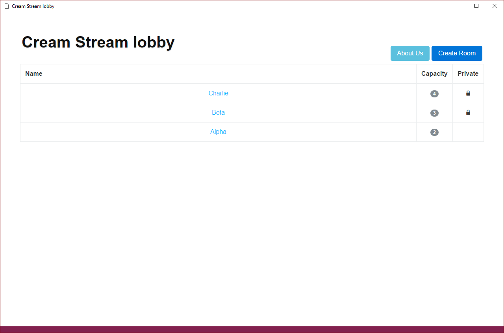
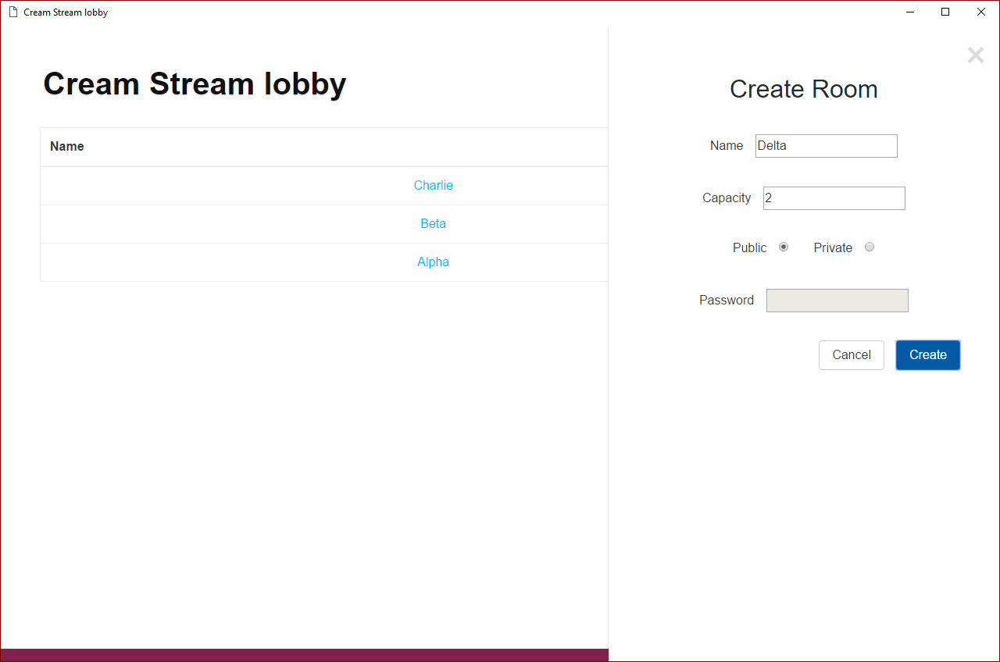
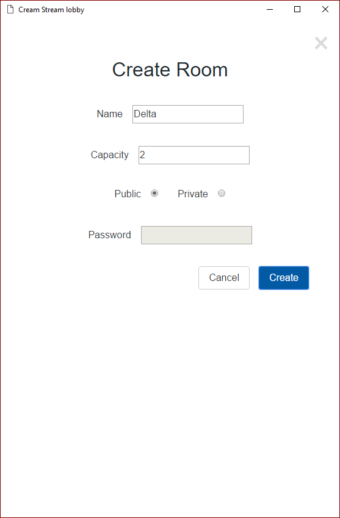

# Cream
| master        | develop       |
| ------------- |:-------------:|
| [](https://travis-ci.org/ZombieHippie/cream/branches) | [](https://travis-ci.org/ZombieHippie/cream/branches) |

## Presentations

* [Demo 04 - Test Plan](https://docs.google.com/presentation/d/1lZNehuVv-Wu1LjkNz4hj5ebNvVpZn6-D91BN4LBBG3Q/edit?usp=sharing)

## Screenshots




## Installation

* Install git from git-scm
* Install node

```
git clone https://github.com/ZombieHippie/cream

cd cream

npm install
```

## Debugging

Use nodemon to restart server on changes

use nodemon with:

```
npm run dev
```

## Testing

```
npm test
```

## Environment

`MONGODB_HOST`

`MONGODB_DB`

## Steps to Setup this Application through Azure

#### GitHub Setup
* First step is to create an account on github if you don't have one already.
* After you have made a new account and logged in, create a new repository.
* Name your repository whatever you want and you can make it public or private and there is no need to check the box to initialize a readme.
* Click Create repository.
* On the next screen scroll down and click on "Import Code"
* Here you will put this URL into the text box https://github.com/ZombieHippie/cream.git
* Then click "Begin Import" and after it is done importing continue on to the repository.
* You have finished completing the GitHub portion. Now on to linking this to Microsoft Azure.

#### Azure Setup
* Log into your Azure account or create an Azure account.
* Once in Azure Create a new "Web App"
* Once that is created go to the Web App and go into Setting and click on "Deployment Source"
* When in Deployment Source click "Choose Source"
* For your source click on "GitHub by GitHub"
* After that for authorization, log in to your GitHub account you made earlier.
* For organization choose "Personal"
* For the project choose the repository you cloned and made earlier.
* Finally for branch choose master.
* Now your Web App should be almost complete. Last step is making the database and setting the environment variables.

#### Database Setup and Environment Variables
1. First you need a Mongo Database.
2. You can make one through Azure by clicking on "New" on the left hand side.
3. Then search for "MongoLab"
4. Click on MongoLab when it pops up then click on the "Create" button.
5. This will bring you to the Azure Marketplace. Here it will ask for you to "Choose a Developer Service".
6. Scroll down and click on "mLab MongoDB" and click on the arrow towards the bottom right to go to the next step.
7. Here you can choose what type of database you want and name it. After picking your preferred settings click on the right arrow to go to the next step.
8. This last page is just to show the cost of your database. Once satisfied click on the check mark to purchase.
9. Once the Mongo Database has been created click on it and click on the link under the "Manage your application and service"
10. Now that you are on the mLab website click on the "Users" tab and click on the "Add database user" button.
11. Make your username and password and do not check the read-only box. Make sure to remember the username and password for the next steps.
12. Now we will go back to the Web App you created in Azure.
13. Click on your Web App and then click on Settings.
14. In the Settings scroll down to the "General" section and click on "Application settings"
15. In Application settings make sure to turn "Web sockets" on and keep scrolling down to the "App settings" section.
16. Here is where we add the environmental variables.
17. You will put these "Keys" in with their corresponding "Value"
18. For the Mongo DB, the easiest way will be to copy the line under the "To connect using a driver via the standard MongoDB URI" after the "mongodb://" part. This is on the mLab website you went to in step 10. Here is what you should have copied (this is my database, bolded parts may be different for you):
	(dbuser):(dbpassword)@**ds064748**.mlab.com:**(dbport)/(dbname)**

| Key		|	Value |
|:------------- |:-------------:|
| NO_SSL	|	1 |
| MONGODB_HOST	| (dbuser):(dbpassword)@ds064748.mlab.com |
| MONGODB_DB	|	(dbname) |
| MONGODB_PORT	|	(dbport) |

* (dbuser) and (dbpassword) is the username and password you created in step 11.
* (dbname) is the name you gave your database in step 7. Also found in the line of text you copied.
* (dbport) is the port the database uses. You can find this in the line of text you copied.

Once that is completed click "Save" at the top of the "Application settings" page in Azure.

Congratulations!
Now that you have completed all of that you should be done! Now you can make code changes to your own repository and Azure should automatically update your website.
